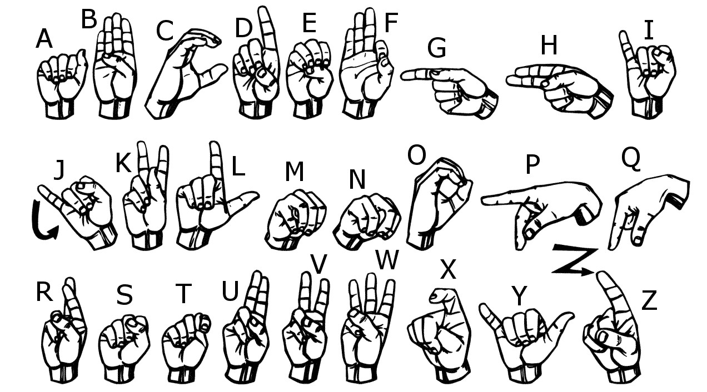

# sign-language-conversion
## DataSet
DataSet is imported from "https://www.kaggle.com/code/rahulmakwana/sign-language-recognition-vgg16-resnet50"
## Sign Recognition using Blackbox AI

This project leverages a blackbox Artificial Intelligence model for the task of sign language recognition. By utilizing a pre-trained or custom-trained deep learning network, the system is designed to identify various hand gestures and signs from image or video input. This approach allows for the learning of intricate patterns and nuances within sign language without requiring explicit manual feature engineering. While the internal decision-making processes of the AI model remain opaque, the focus is on achieving high accuracy and robust performance through extensive training on diverse datasets. This method is particularly advantageous for handling the complexity and variability inherent in sign language communication.

## Abstract

Since most people do not know sign language and interpreters are hard to find, we have developed a real-time neural network-based method for fingerspelling-based American sign language. Sign language is one of the oldest and most natural forms of language for communication.
 
The hand is first run through a filter in this method, and then it is run through a classifier that determines the class of the hand gestures. For the 26 arranged by alphabet letters, this method yields 98.00% accuracy.

## Project Description

The most common sign language is American sign language. The only means of communication for D&M individuals is sign language because their only disability is related to communication and they are unable to use spoken languages. 

The process of exchanging ideas and messages through speech, signals, behavior, and visuals is known as communication. 

People who are Deaf and Mute (Dumb) (D&M) use their hands to make various gestures to communicate their thoughts to others. 

Nonverbal cues are conveyed through gestures, which are interpreted by vision. Sign language is the nonverbal communication used by the deaf and dumb.

Sign language is a visual language and consists of 3 major components 


In this project I basically focus on producing a model which can recognize Fingerspelling based hand gestures in order to form a complete word by combining each gesture.

The gestures I  trained are as given in the image below.




## Libraries Requirements -(Requires the latest pip version to install all the packages)


```bash
1. Lastest pip -> pip install --upgrade pip

2. numpy -> pip install numpy

3. string -> pip install strings

4. os-sys -> pip install os-sys

5. opencv -> pip install opencv-python

6. tensorFlow -> i) pip install tensorflow 
                 ii) pip3 install --upgrade https://storage.googleapis.com/tensorflow/linux/cpu/tensorflow-0.8.0-cp34-cp34m-linux_x86_64.whl

7. keras -> pip install keras

8. tkinter -> pip install tk

9. PIL -> pip install Pillow

10. enchant -> pip install pyenchant (Python bindings for the Enchant spellchecking system)

11. hunspell -> pip install cyhunspell (A wrapper on hunspell for use in Python)
```

## Running the Project 

``` python
python /path/to/the/Application.py
```
